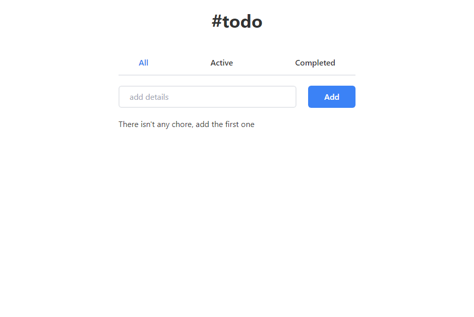

<!-- Please update value in the {}  -->

<h1 align="center">{Todo App with React Hooks and Tailwind CSS}</h1>

<div align="center">
   Solution for a challenge from  <a href="http://devchallenges.io" target="_blank">Devchallenges.io</a>.
</div>

<div align="center">
  <h3>
    <a href="https://todo-app-react-ft.netlify.app/">
      Demo
    </a>
    <span> | </span>
    <a href="https://devchallenges.io/solutions/GlgEwtl90KRImdGWGbPf">
      Solution
    </a>
    <span> | </span>
    <a href="https://devchallenges.io/challenges/hH6PbOHBdPm6otzw2De5">
      Challenge
    </a>
  </h3>
</div>

<!-- TABLE OF CONTENTS -->

## Table of Contents

- [Overview](#overview)
  - [Built With](#built-with)
- [Features](#features)
- [How to use](#how-to-use)
- [Contact](#contact)
- [Acknowledgements](#acknowledgements)

<!-- OVERVIEW -->

## Overview



Introduce your projects by taking a screenshot or a gif. Try to tell visitors a story about your project by answering:

- You can see a demo on this URL: "https://todo-app-react-ft.netlify.app/"
- I learned better how to use the React Hooks and its behavior in many cases

### Built With

- [React](https://reactjs.org/)
- [Tailwind](https://tailwindcss.com/)

## Features

This application/site was created as a submission to a [DevChallenges](https://devchallenges.io/challenges) challenge. The [challenge](https://devchallenges.io/challenges/hH6PbOHBdPm6otzw2De5) was to build an application to complete the given user stories.

## How To Use

To clone and run this application, you'll need [Git](https://git-scm.com) and [React](https://reactjs.org/) (which comes with [npm](http://npmjs.com)) installed on your computer. From your command line:

```bash
# Clone this repository
$ git clone https://github.com/freddyval7/todo-app-react

# Install dependencies
$ npm install

# Run the app
$ npm run dev
```

## Contact

- Website [My Portfolio](https://ftdev-portfolio.netlify.app/)
- GitHub [@freddyval7](https://github.com/freddyval7/})
- Twitter [@your-twitter](https://{twitter.com/your-username})
